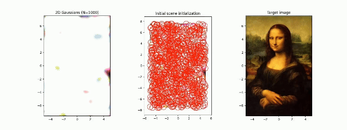

# Tiny Gaussian Splatting in 2D



Splatting 2D Gaussians to represent images. Tiny, self-contained, low-overhead,
and minimal implementation in a single Jupyter notebook.

This code grew out of some of my research I was doing during my Master's studies. I thought it'd be fun to share a
simplified version as a standalone notebook.

I helped create a modified version of this notebook as part of a homework assignment for the Georgia Tech course 
CS8803/4803 CGA: Computer Graphics in the AI Era. You can find more information about the course here:
[https://cgai-gatech.vercel.app/](https://cgai-gatech.vercel.app/). You can also
find my corresponding guest lecture on 3D Gaussian Splatting on YouTube:
[https://youtu.be/MBVmQSA24Yk](https://youtu.be/MBVmQSA24Yk).

## Install dependencies

TLDR: `pip install -r requirements.txt`

Using `pip` and `venv`:
1. Create a virtual environment: `python3 -m venv venv`
2. Activate this environment:
```
# MacOS/Linux
source venv/bin/activate

# Windows
venv\Scripts\activate
```

Once activated, `pip` will refer to packages installed in the `venv` folder
(e.g. `venv/lib/python[your-version]/site-packages`)

3. Install required packages: `pip install -r requirements.txt`

4. (Optional) Include specific version numbers from
   `backup-requirements-frozen-versions.txt`

5. You can deactivate the virtual environment using ```deactivate```

## Run Jupyter notebook locally
```
jupyter notebook
```
